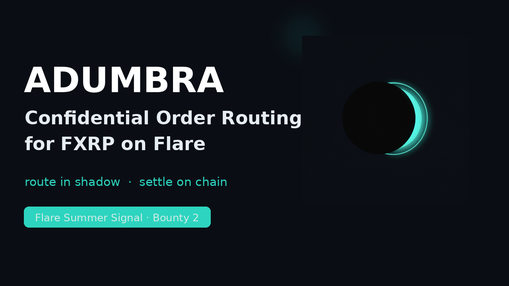
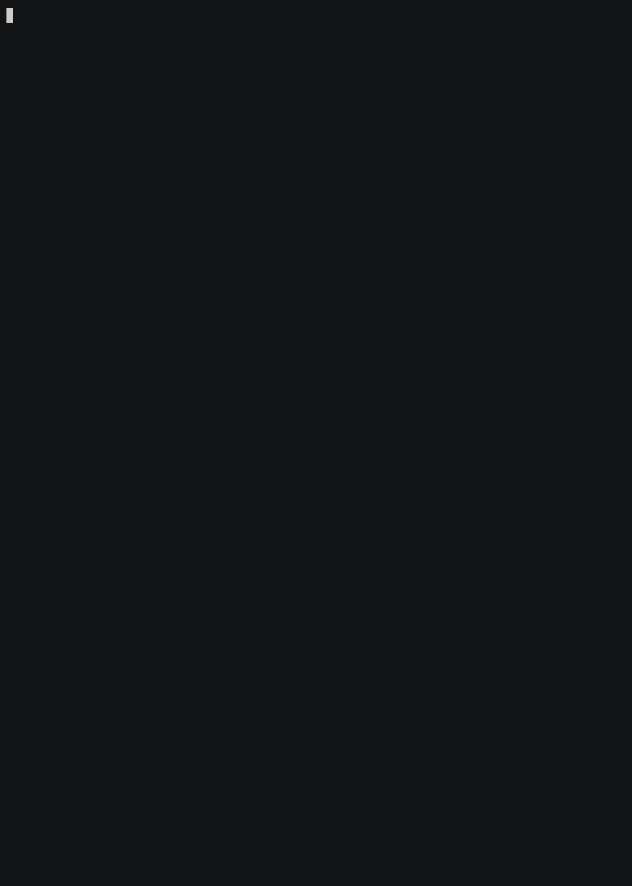

<div align="center">


# Adumbra

**Confidential Order Routing for FXRP on Flare.**
*Route in shadow. Settle on chain.*

</div>

Adumbra runs swap route selection inside a Trusted Execution Environment. The enclave
computes the optimal path and the slippage floor privately, then signs a constrained
order. On-chain, only the enclave signature is verified and the order executed — the
route, the exact quote, and the slippage strategy never enter the public mempool, so MEV
searchers have nothing to front-run.

*Adumbrare* (Latin) — to outline in shadow.

## Hackathon

Flare Summer Signal — **Bounty 2: Confidential Compute Apps** ($6,000 pool)

## Demo

**Live online:** https://adumbra.carly17.my.id/ — connect MetaMask on Coston2 and swap directly.
The enclave signs orders at `/tee/sign`.

**Video demo** — end-to-end enclave-signed swap on Coston2 (44 s, no voiceover):  
[](https://www.youtube.com/watch?v=F1YGEdOaawk)



The recording above is a real run against the live Coston2 deployment: the enclave signs
an order, the contract verifies it, and the swap settles on chain. Reproduce it with
`bash scripts/demo_walkthrough.sh` (raw asciinema cast in `media/demo.cast`, full mp4 in
`media/adumbra_demo_video.mp4`).

## Live Deployment (Flare Coston2, chainId 114)

| Contract | Address |
|---|---|
| AdumbraRouter | [`0xcA1BFA56281a5082EfcAa64bbd34653b0AfCCAc7`](https://coston2-explorer.flare.network/address/0xcA1BFA56281a5082EfcAa64bbd34653b0AfCCAc7#code) |
| Mock FXRP | [`0x92bdD788e158Db8d7b0F2Dc32ddefe0fC8783fC5`](https://coston2-explorer.flare.network/address/0x92bdD788e158Db8d7b0F2Dc32ddefe0fC8783fC5#code) |
| Mock USDC | [`0x1cAAb501Cb8D7959e5Def5577863a4b346523552`](https://coston2-explorer.flare.network/address/0x1cAAb501Cb8D7959e5Def5577863a4b346523552#code) |

All three contracts are **source-verified** on the Coston2 explorer.

Verified enclave-signed swap on Coston2: tx [`0x1b70cd039ac67c20dff3ea77b299d79f74c57cda5c2a8d8530be7ce6b512432b`](https://coston2-explorer.flare.network/tx/0x1b70cd039ac67c20dff3ea77b299d79f74c57cda5c2a8d8530be7ce6b512432b) — 100 FXRP in, 51.74 USDC out, router nonce 8 → 9.

## The Problem

Every public swap leaks its own alpha. Route, amounts, and slippage tolerance sit in
calldata in the mempool before execution — which is exactly the information a searcher
needs to sandwich the trade. On Flare, FXRP and FAssets users inherit this problem from
the EVM execution model itself, not from any bug in a DEX.

## The Approach

Move the profitable information out of the public path. Adumbra's enclave decides the
route and the slippage floor where nobody can observe it, and emits an order that the
chain can verify but not reverse-engineer.

```
 Wallet UI (viem + MetaMask)
    │
    │  1. swap intent (user, tokenIn, tokenOut, amountIn, slippage)
    ▼
 [ Adumbra Enclave ]  ── HTTP :7070 POST /sign
    │  2. compute optimal route privately
    │  3. derive minAmountOut + deadline + nonce
    │  4. sign the order with the attested enclave key
    ▼
 Signed Order — the only thing that becomes public
    user, tokenIn, tokenOut, amountIn, minAmountOut, deadline, nonce, signature
    ▼
 AdumbraRouter (Flare Coston2)
    │  5. ecrecover against the pinned enclave key (EIP-2 low-s enforced)
    │  6. deadline + nonce replay guard
    │  7. pull input, deliver output, bump nonce
    ▼
 Settled tx — all a searcher ever sees, and only after the fact
```

### Privacy Boundary

| Private (inside the enclave) | Public (on-chain) |
|---|---|
| route path and intermediate hops | `tokenIn`, `tokenOut` |
| exact price quote | `amountIn`, `minAmountOut` |
| slippage strategy | `deadline`, `orderNonce` |
| enclave signing key | enclave `signature` |

### Trust Assumptions

- The enclave signing key is pinned at deploy time as an immutable (`enclaveSigner`). In
  production it is bound to a hardware attestation — an SGX quote or Nitro PCR
  measurement — which the contract verifies before accepting the key.
- Users trust the enclave for **route quality only, never custody**. Funds move solely
  through an order bound to `order.user`, capped at `amountIn`, floored at
  `minAmountOut`, expiring at `deadline`, and single-use per nonce. A compromised enclave
  cannot drain a user; it can at worst give a bad-but-bounded quote.
- The contract is the enforcement layer. Everything the enclave decides in private is
  still constrained in public.

### Why Confidential Compute Rather Than a Normal Smart Contract

A pure on-chain router has no way to hide its inputs: contract calldata and state are
public by construction, so route and slippage parameters are visible before the trade
lands. This is not an implementation flaw that better Solidity can fix — it is the
execution model. A TEE changes *when* the information becomes public: by the time the
route is observable, the trade is already settled and there is no ordering advantage
left to extract.

## Repo Layout

```
adumbra-flare/
├── src/
│   ├── AdumbraRouter.sol      # on-chain verification + execution
│   └── mocks/MockERC20.sol
├── test/AdumbraRouter.t.sol   # 6 Foundry tests
├── tee/
│   ├── Cargo.toml
│   └── src/main.rs            # enclave service: CLI + HTTP :7070 modes
├── frontend/index.html        # viem + MetaMask wallet UI
├── media/
│   ├── logo.png               # project logo
│   ├── social-preview.png     # 1280x640 open-graph card
│   ├── youtube_thumbnail.png  # YouTube thumbnail
│   ├── demo.gif               # end-to-end run against live Coston2
│   ├── demo.mp4
│   └── demo.cast              # raw asciinema recording
├── scripts/
│   ├── demo_walkthrough.sh    # narrated live-network demo (recorded above)
│   ├── e2e_demo.sh            # full local end-to-end run
│   └── encode_calldata.py     # nested-tuple ABI encoder
├── SUBMISSION.md
└── README.md
```

## Stack

| Layer | Technology | Role |
|---|---|---|
| Confidential compute | Rust enclave service (SGX / Nitro model) | Private route computation + order signing |
| On-chain | Solidity 0.8.x, Foundry | Signature verification + execution guard |
| Network | Flare Coston2 (deployed) | Live testnet deployment |
| Frontend | viem + MetaMask | Wallet UI showing only the settled transaction |

## Running It

### Prerequisites
Rust 1.78+, Foundry (`foundryup`), Python 3.12 with `eth-abi` and `pycryptodome`.

### Tests
```bash
forge test
```
```
[PASS] testHappyPath()          (gas: 133235)
[PASS] testRevertExpired()      (gas: 30982)
[PASS] testRevertReplay()       (gas: 131021)
[PASS] testRevertSlippage()     (gas: 72450)
[PASS] testRevertTamperedOrder() (gas: 36520)
[PASS] testRevertWrongSigner()  (gas: 39451)
6 passed; 0 failed
```

### Enclave service
```bash
cd tee && cargo build --release

# one-shot CLI mode
ENCLAVE_KEY=<hex> ./target/release/adumbra-enclave --intent - --nonce 0 < intent.json

# HTTP server mode (used by the frontend)
ENCLAVE_KEY=<hex> ./target/release/adumbra-enclave --serve   # listens on :7070
```

### End-to-end demo (local anvil)
```bash
anvil --port 8545 &
# deploy router + mocks, write /tmp/addresses.env, then:
bash scripts/e2e_demo.sh
```

### Frontend
**Live:** https://adumbra.carly17.my.id/ — connect MetaMask on Coston2 and swap directly.

For local development:
```bash
cd frontend && python3 -m http.server 8080
# open http://localhost:8080 with MetaMask on Coston2
```

## Built During the Program

Adumbra was built from scratch during Flare Summer Signal — there was no pre-existing project.

- `AdumbraRouter.sol` — enclave signature verification via `ecrecover` with EIP-2
  low-s enforcement, nonce replay guard, deadline enforcement, slippage floor, atomic
  swap execution.
- `tee/src/main.rs` — the enclave service. Private route and rate computation,
  keccak256 digest construction byte-compatible with Solidity `abi.encode`, recoverable
  ECDSA signing, plus both a CLI one-shot mode and an HTTP `/sign` server mode with CORS.
- `frontend/index.html` — viem + MetaMask app: reads the on-chain nonce, requests the
  enclave signature, handles ERC20 approval, and submits `executeSwap`.
- `scripts/encode_calldata.py` — ABI encoder for the nested `SignedOrder` tuple, a shape
  `cast` cannot parse.
- `scripts/e2e_demo.sh` — full local end-to-end verification run.
- Coston2 deployment and multiple verified on-chain enclave-signed swaps.

## Roadmap

1. **Real routing** — multi-hop quoting inside the enclave against SparkDEX and
   BlazeSwap, replacing the current dev rate table.
2. **Attested keys** — on-chain verification of the SGX quote / Nitro PCR so the signing
  key is provably enclave-bound rather than deployer-pinned.
3. **AMM execution** — settle along the enclave-chosen path instead of the single-leg
   reserve model used for this demo.
4. **Sealed-bid batching** — clear multiple intents in one batch so ordering-based MEV
   disappears entirely rather than being merely hidden.
5. **Songbird, then Flare mainnet.**

## License

MIT
